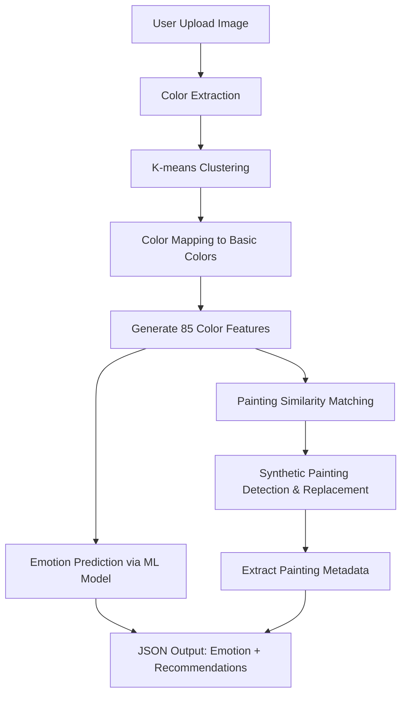

# Painting Recommendation Service (recommendation_service_embedded.py)

A machine learning-powered recommendation system that analyzes uploaded images to extract color features, predict emotions, and recommend similar paintings from the WikiArt dataset.

## 🔄 Data Flow Overview



## 📥 Input Requirements

### Command Line Usage
```bash
python3 recommendation_service_embedded.py <image_path>
```

### Input Files Required

1. **User Image** (Primary Input)
   - **Format**: PNG, JPG, JPEG, or other PIL-supported formats
   - **Source**: Uploaded by user through web interface
   - **Example Path**: `/app/frontend-vue/dist/static/uploads/1.png`

2. **Resampled Emotions Dataset**
   - **Path**: `/app/emotions_generation/resampled_emotions_data.csv`
   - **Format**: CSV with 85 color features + painting metadata
   - **Columns**: Basic colors (12) + color ratios (26) + dominance features (26) + complementary (3) + analogous (5) + temperature/balance (12) + url
   - **Sample Row**:
     ```csv
     black,blue,brown,green,grey,orange,pink,purple,red,turquoise,white,yellow,red_blue_ratio,...,url
     0.1234,0.2345,0.0123,...,https://uploads0.wikiart.org/00120/images/agostino-tassi/naufragio-della-flotta-di-enea-1627.jpg
     ```

3. **ML Model Files** (Optional - fallback to simple prediction if missing)
   - **Emotion Model**: `/app/emotions_generation/final_emotion_model.pkl`
   - **Feature Scaler**: `/app/emotions_generation/final_scaler.pkl`
   - **Feature Info**: `/app/emotions_generation/final_feature_info.pkl`

## 🔍 Processing Pipeline

### Step 1: Color Extraction
```python
# Input: RGB image
# Process: K-means clustering (5 clusters)
# Output: Dominant colors with percentages

# Example extracted colors:
Raw Color 1: RGB(64, 150, 180) - 35.20%
Raw Color 2: RGB(200, 120, 90) - 28.40%
Raw Color 3: RGB(30, 80, 50) - 20.15%
# ... etc
```

### Step 2: Color Mapping
```python
# Maps extracted RGB to 12 basic colors using CIEDE2000 distance
# Example mapping:
{
    'turquoise': 0.2784,
    'pink': 0.2507,
    'blue': 0.2044,
    'yellow': 0.1461,
    'grey': 0.1204
}
```

### Step 3: Feature Engineering
Generates 85 color features:
- **Basic Colors (12)**: Direct percentages of each basic color
- **Color Ratios (26)**: `red_blue_ratio = red_pct / (blue_pct + 0.001)`
- **Dominance Features (26)**: Binary flags for color dominance
- **Complementary (3)**: Presence of complementary color pairs
- **Analogous Groups (5)**: Presence of analogous color schemes
- **Temperature & Balance (12)**: Warm/cool ratios, diversity metrics

### Step 4: Emotion Prediction
```python
# Uses trained ML model or simple rule-based fallback
# Example emotion prediction:
{
    "emotion": "happiness",
    "confidence": 0.78,
    "all_probabilities": {
        "happiness": 0.78,
        "excitement": 0.65,
        "calmness": 0.45,
        # ... other emotions
    }
}
```

### Step 5: Painting Recommendation
- Calculates cosine similarity between user's 85 features and all paintings in dataset
- Detects and replaces synthetic paintings with similar original paintings
- Returns top 10 most similar paintings

## 📤 Output Format

### Console Output
```
=== Extracting colours from /path/to/image.png ===
Raw colors extracted from image:
  Raw Color 1: RGB(64, 150, 180) - 35.20%
  Raw Color 2: RGB(200, 120, 90) - 28.40%

Final colour selection:
  turquoise: 0.2784
  pink: 0.2507

=== Emotion Prediction ===
Predicted emotion: happiness
Confidence: 78.0%

--- Top 10 Recommended Painting URLs ---
1. https://uploads0.wikiart.org/00120/images/agostino-tassi/naufragio-della-flotta-di-enea-1627.jpg
2. https://uploads5.wikiart.org/00112/images/claude-monet/water-lilies-1919-2.jpg
# ... etc
```

### JSON Output (Detailed Recommendations)
```json
--- DETAILED_RECOMMENDATIONS_JSON ---
[
  {
    "url": "https://uploads0.wikiart.org/00120/images/agostino-tassi/naufragio-della-flotta-di-enea-1627.jpg",
    "artist": "Agostino Tassi",
    "title": "Naufragio Della Flotta Di Enea",
    "year": "1627"
  },
  {
    "url": "https://uploads5.wikiart.org/00112/images/claude-monet/water-lilies-1919-2.jpg",
    "artist": "Claude Monet",
    "title": "Water Lilies",
    "year": "1919"
  }
  // ... 8 more paintings
]
--- END_DETAILED_RECOMMENDATIONS_JSON ---
```

### JSON Output (Emotion Prediction)
```json
--- EMOTION_PREDICTION_JSON ---
{
  "emotion": "happiness",
  "confidence_percentage": "78.0%",
  "all_probabilities": {
    "happiness": 0.7834,
    "excitement": 0.6521,
    "calmness": 0.4523,
    "curiosity": 0.3891,
    "love": 0.3456,
    "optimism": 0.3234,
    "trust": 0.2987,
    "anticipation": 0.2654,
    "gratitude": 0.2341,
    "surprise": 0.1987,
    "humility": 0.1654,
    "disagreeableness": 0.1432,
    "sadness": 0.1234,
    "fear": 0.0987,
    "disgust": 0.0654
  }
}
--- END_EMOTION_PREDICTION_JSON ---
```

## 🔗 Integration Points

### Input Source
- **Web Frontend**: Vue.js application uploads images to `/app/frontend-vue/dist/static/uploads/`
- **Server Integration**: Flask server (`server.py`) calls this script with uploaded image path
- **API Endpoint**: `/analyze-colors` endpoint in Flask app triggers this service

### Output Destination
- **Server Response**: Flask server parses JSON output and returns to frontend
- **Database Storage**: Recommendations may be cached in database
- **Frontend Display**: Vue.js displays recommended paintings in gallery format

## 🛠️ Configuration

### Environment Variables & Paths
```python
# Data paths
RESAMPLED_DATA_PATH = "/app/emotions_generation/resampled_emotions_data.csv"
MODEL_PATH = "/app/emotions_generation/final_emotion_model.pkl"
SCALER_PATH = "/app/emotions_generation/final_scaler.pkl"
FEATURE_INFO_PATH = "/app/emotions_generation/final_feature_info.pkl"

# Processing parameters
NUM_RECOMMENDATIONS = 10
NUM_FEATURES = 85
```

### Basic Color Palette
```python
BASIC_COLOURS = {
    'black': (0, 0, 0),
    'blue': (0, 0, 255),
    'brown': (139, 69, 19),
    'green': (0, 128, 0),
    'grey': (128, 128, 128),
    'orange': (255, 165, 0),
    'pink': (255, 192, 203),
    'purple': (128, 0, 128),
    'red': (255, 0, 0),
    'turquoise': (64, 224, 208),
    'white': (255, 255, 255),
    'yellow': (255, 255, 0)
}
```

## 🎯 Key Features

### 1. **Advanced Color Analysis**
- Uses CIEDE2000 color difference algorithm (perceptually uniform)
- K-means clustering for dominant color extraction
- 85-dimensional feature space for comprehensive color representation

### 2. **Synthetic Painting Handling**
- Automatically detects synthetic/generated paintings in recommendations
- Replaces synthetic paintings with similar original artworks
- Maintains recommendation quality while ensuring authenticity

### 3. **Emotion Prediction**
- ML-powered emotion classification based on color psychology
- Fallback to rule-based prediction if models unavailable
- 15 different emotion categories with confidence scores

### 4. **Robust Error Handling**
- Graceful fallback for missing model files
- Default color selection if image processing fails
- Comprehensive error logging and user feedback

## 🔧 Usage Examples

### Basic Usage
```bash
# Analyze uploaded image
python3 recommendation_service_embedded.py /app/uploads/user_image.jpg
```

### Integration in Flask Server
```python
import subprocess
import json

def get_recommendations(image_path):
    try:
        result = subprocess.run([
            'python3', 'recommendation_service_embedded.py', image_path
        ], capture_output=True, text=True)
        
        # Parse JSON outputs from stdout
        output_lines = result.stdout.split('\n')
        # Extract JSON sections between markers
        # Return structured data to frontend
        
    except Exception as e:
        return {"error": str(e)}
```

## 📊 Performance Considerations

- **Image Processing**: ~2-5 seconds for color extraction
- **Feature Generation**: ~0.1 seconds for 85 features
- **ML Prediction**: ~0.5 seconds with loaded models
- **Similarity Matching**: ~1-3 seconds for 10,000+ paintings dataset
- **Total Processing Time**: ~3-10 seconds per request

## 🐛 Troubleshooting

### Common Issues
1. **Missing Model Files**: Falls back to simple emotion prediction
2. **Invalid Image Path**: Returns error and exits
3. **Corrupted Dataset**: Check CSV file integrity
4. **Memory Issues**: Reduce dataset size if needed

### Debug Output
Enable verbose logging by checking console output for:
- Color extraction details
- Feature generation logs
- Model loading status
- Similarity calculation progress